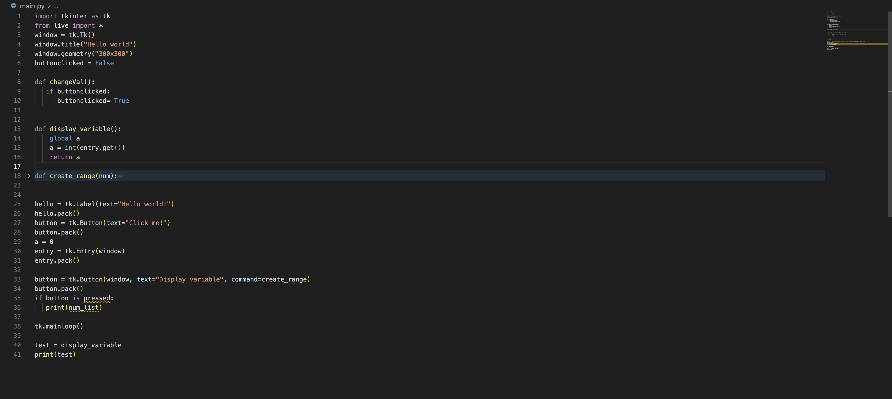
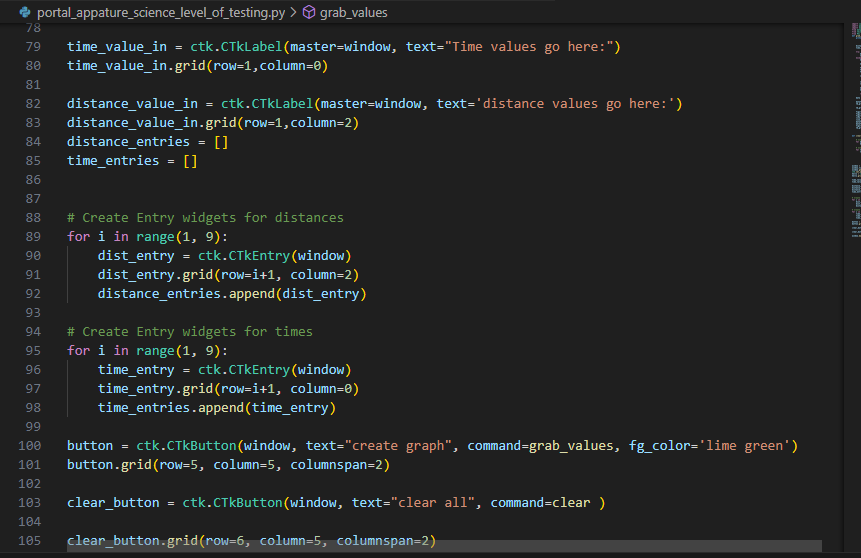
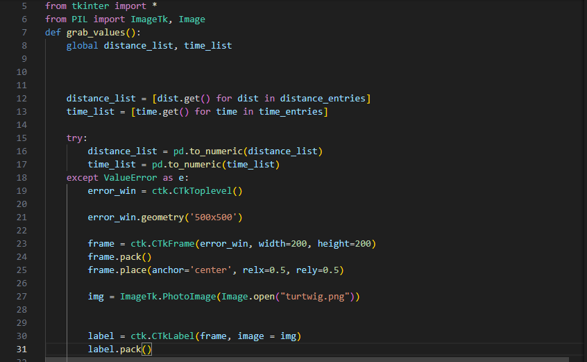

# Updates :)

## 12/4/23

today I was trying to create a function that created a list from an input number
now i have a new problem how do I get the multiple variables from the entry 
I also need to find a way to input the value into the time and distance list.

shown here I used a function that I had to ask an AI to help me out with however I had to come up with a way to convert the from a tkinter entry then a button press.

## 12/6/2023

Today I continued to work on my project by coming up with an actual system that would get the input values from the entries, so instead of coming up with multiple functions, I placed all the necessary variables in the functions which displaces the variables input.

this is the function that I used to test out displaying the list from the inputted values that would show when the button is pressed.

## 12/8/2023 
What I did was incorporate the function shown in the previous update with some tweaks like adding more entries to accommodate the two lists of variables(time and distance).

This a visual to see what I did Next update I'll add the graphing parts of the two variable lists.

## 12/12/2023

While working now the code I found a more effective way to produce multiple entries using FOR loops and append which allows for the splitting of the entries to be independent.

I also worked on creating an error window that would show up as the graph does not get created because there is a space or a string as these two things are not able to process these.

Here I used a try and expect to check for the strings and spaces if there is a string or space the error window will pop up and tell you where the error is.

